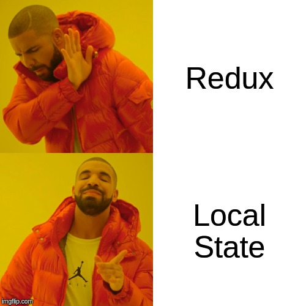

# But does it need to be this complex?

## Seriously! Most apps would be perfectly fine without Redux

HTTP is Stateless. Means the only way to really persist information is in the URI. \(Reload your precious Redux app and see what's left of your complexity.\)

One route should generally be manageable even if you hold you state in the parent component. 

Believe me, im most cases still be easier and better understandable then a flux like architecture.

