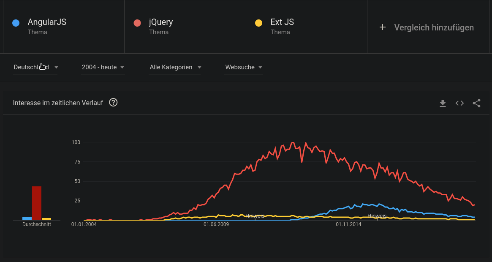

# JavaScript is very fragile

Try to keep you application clean and simple, so you can easily adapt to changes of the ecosystem.

One of the most important things about your application \(besides that it solves the usecase\) is that others understand it well. Because at some point someone else will probably have to maintain what you build today. Don't try to create something unnecessarily complex or particularly clever.

