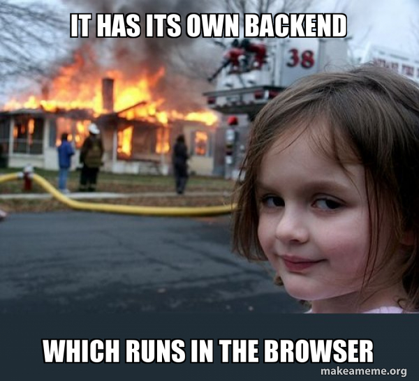

# The Monolithic Frontend App

There where pretty clear instruction you choosed to ignore

### And now you got a Monolithic Frontend App.

Does this sound adventurous? Believe me it really is!

Now is a good time to recruit new developers. Because you will need alot of them!

The new way of calculating this would be two times the number of backend engineers.

