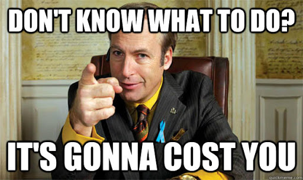

# The Author's opinion

[Full read](https://medium.com/@dan_abramov/you-might-not-need-redux-be46360cf367)

Arround this time he stopped contributing to the project

There are also some twitter posts where he expressed his thoughts

Create your own picture

But to me it seems you should only use Redux if there is a really good reason todo so

