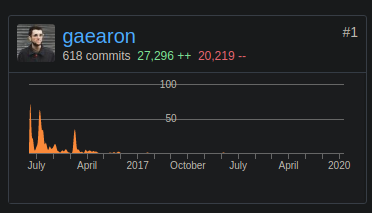

# The Cost of Redux

* Considerably more boilerplate code.
  * More code causes more errors which needs more testing.
  * Harder to follow the flow of the application.
  * Developers spend more time staring into the abyss.
  * [Application will be slow on older devices](https://www.youtube.com/watch?v=ff4fgQxPaO0).
* One large global state is often more confusing and complex than many decentralized local states.
* Significantly more dependencies.
* Creating new features is considerably more expensive.
* Introducing new developers is considerably more expensive.
* Harder to refactor in ~3-5 years.

